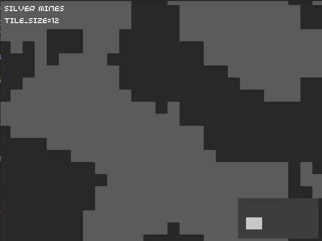

# Royal Silver Mines



2D top-down rpg simulator inspired by Dwarf Fortress, simplified.
Built for the PicoSystem, Linux and Windows using 32blit.

Become the Overseer of The Royal Silver Mines! The player was chosen by the Crown to manage the mines to extract and deliver Silver for the kingdom and army.
Defend against saboteurs, disasters and survive the Crown's Quotas.
Manage workers, mine silver, reach the quota, gain GLORY! Avoid the Debt to the King.


## Usage

For local builds this is:
```
mkdir build
cd build
cmake -D32BLIT_DIR=/path/to/32blit-sdk/ ..
```

Platform/Editor specific insctuctions [can be found in the main 32blit repo](https://github.com/32blit/32blit-sdk#you-will-need)